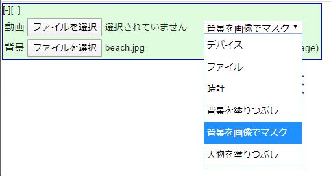

# Chrome Vritual Camera

navigator.mediaDevices.getUserMedia()をフックし、ダミーの時計や動画ファイルを流すことができるChrome Extensionです。
[tfjs/body-pix](https://github.com/tensorflow/tfjs-models/tree/master/body-pix)を利用した人物の検出、背景マスクができます。

Chrome extention for virtual camera, using hook of navigator.mediaDevices.getUserMedia()

## Reference / 参考にしたもの

- https://techblog.securesky-tech.com/entry/2020/04/30/
- https://github.com/hasegawayosuke/vitamin-meeeeet (MIT LICENSE)
- https://github.com/tensorflow/tfjs-models/tree/master/body-pix (Apache 2.0 LICENSE)

## リポジトリ

- https://github.com/mganeko/chrome_virtual_camera

## 使い方

### インストール

- リポジトリをダウンロード or クローン
- 必要に応じて、manifest.jsonを編集する
  - content_scripts, permissions のセクションを編集し、使いたいサイトを追加する
  - 同様に、使いたくないサイトを除外する
- Chrome の [その他のツール]-[拡張機能] の設定ページを開く
- 「デベロッパーモード」を有効にする
- ダウンロードしたリポジトリのフォルダーを選択し、読み込む
- 拡張機能のページで、読み込んだ「Chrome Virtual Camera」が表示、有効なのを確認

### 実行

- 対象サイトをChromeで開く（現在の対象は次の通り）
  - http://localhost:*/* ... ローカルホスト環境
  - http://127.0.0.1:*/* ... ローカルホスト環境
  - https://mganeko.github.io/* ... mganeko の Github Pages
  - https://sora-labo.shiguredo.jp/* ... Sora Labo の検証ページ
  - https://meet.google.com/* ... Google Meet （使い方には注意が必要）
- 拡張機能が読み込まれる
  - mediaDevices.getUserMedia() をフックする
- 左上に小さなパネルが表示される
  - [+]ボタン ... クリックすると、パネルの中身を表示
  - [-]ボタン ... クリックすると、パネルを最小化
  - [_]ボタン ... クリックすると、パネルが左下に移動
  - [^]ボタン ... クリックすると、パネルが左上に移動
- [+]ボタンをクリックして、パネルの中身を表示
- ドロップダウンリストで、方式を選択
  - デバイス ... マシンのカメラ/マイクを利用
  - ファイル ... 動画ファイルを選択し、その映像/音声を利用  
  - 時計 ... Canvas/WebAudioを利用した、デジタル時計
  - 背景を塗りつぶし ... [body-pix](https://github.com/tensorflow/tfjs-models/tree/master/body-pix)を利用して人物を検出、背景をグレーで塗りつぶす
  - 背景を画像で隠す ... [body-pix](https://github.com/tensorflow/tfjs-models/tree/master/body-pix)を利用して人物を検出、背景を画像ファイルで隠す
  - 人物を塗りつぶし ... [body-pix](https://github.com/tensorflow/tfjs-models/tree/master/body-pix)を利用して人物を検出、人物をグレーで塗りつぶす
- 動画ファイルや背景の画像ファイルを選ぶ
  - 方式が「ファイル」の場合、動画ファイルを選択
  - 方式が「背景を画像で隠す」の場合、背景の画像ファイルを選択
- 対象サイトで、カメラ映像/マイク音声の取得を開始、通信を開始
  - mediaDevices.getUserMedia()が呼び出されると、フックした処理が動く
　- 選択した方式の映像、音声が取得される

パネルの中身を表示したところ
 

### 注意点

- 対象サイトがロードと同時にカメラ/マイクを取得する場合 (mediaDevices.getUserMedia()を呼び出す場合)、フックが有効にならず本来のデバイスのカメラ映像/マイク音声が取得される
  - そのページをリロードせずに再度カメラ/マイクの取得を行うと、フックが有効になる
- Google Meet もロードと同時にカメラ/マイクを取得するので、これに該当する
  - パネルで方式を選択後、カメラオフ →　カメラオン に切り替えると、フックが有効になる

## LICENSE / ライセンス

- MIT LICENSE / MITライセンス
- tfjs ... Apache 2.0 LICENSE
